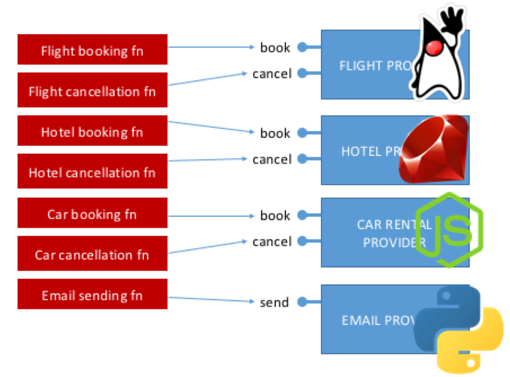
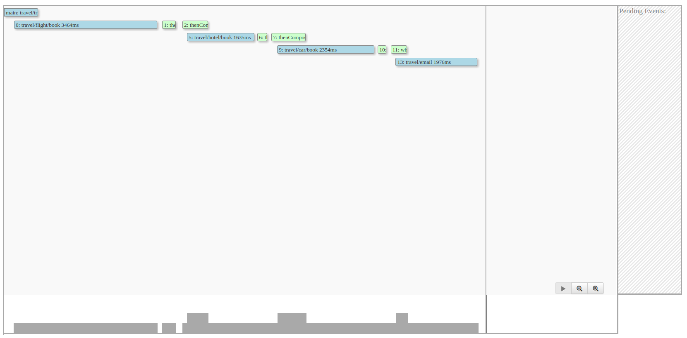
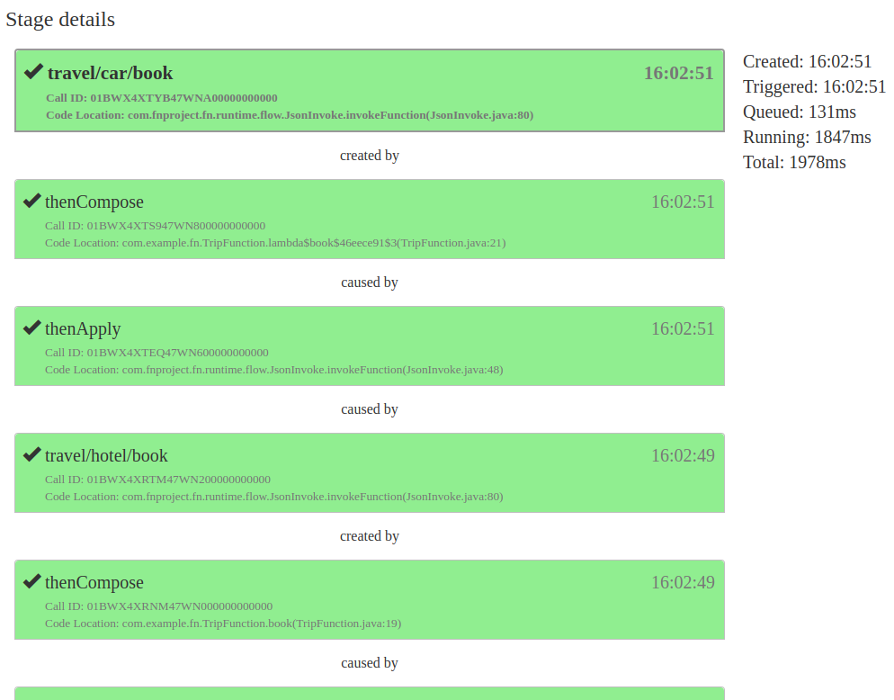
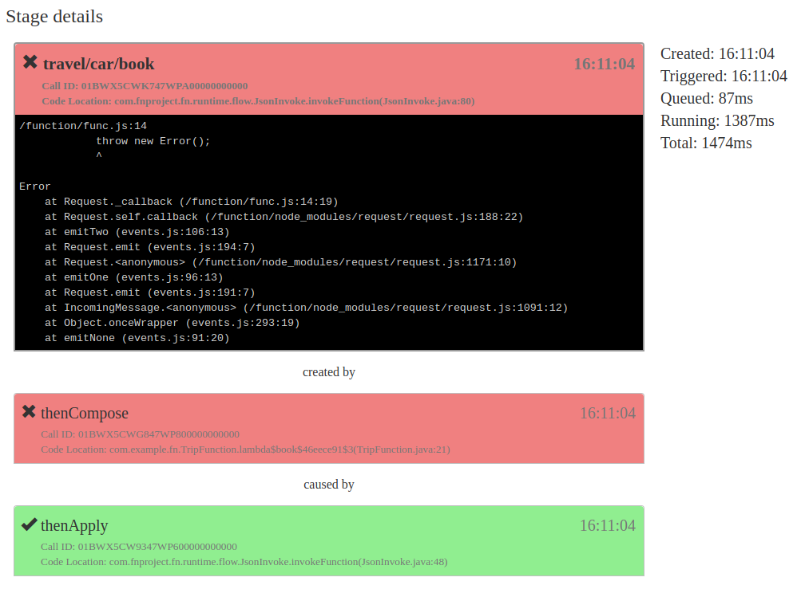
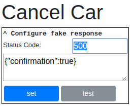
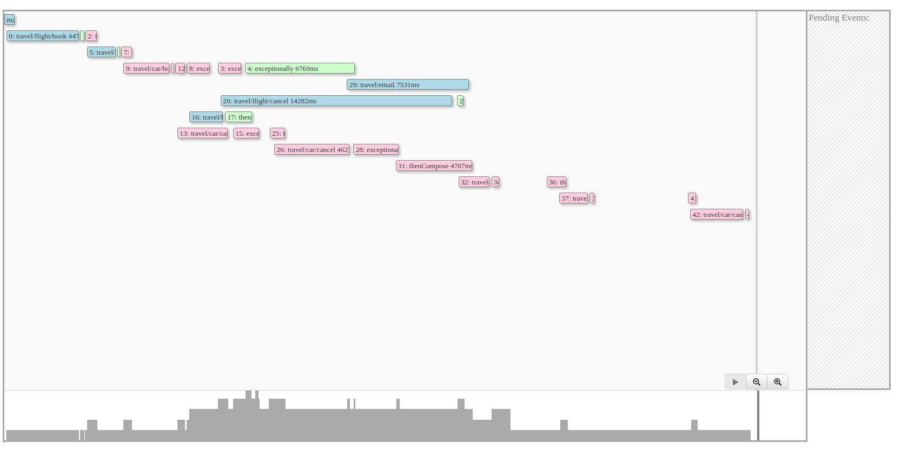

# Fn Flow Tutorial - Serverless Sagas with Fn Flow

This tutorial is based on [Thom Leggett's "Serverless Sagas with Fn Flow" blog post](https://medium.com/fnproject/serverless-sagas-with-fn-flow-d8199b608b12).

In this tutorial we’ll use Fn Flow with the [saga pattern](http://www.cs.cornell.edu/andru/cs711/2002fa/reading/sagas.pdf) to build a fault-tolerant, polyglot, serverless travel booking app. We will write a scalable, fault-tolerant function to book a trip that consists of a flight, a hotel booking and a car rental.

>If you are not familiar with the notion of a saga we encourage you to watch the brilliant talk ["Distributed Sagas: A Protocol for Coordinating Microservices" from @JOTB17](https://youtu.be/0UTOLRTwOX0) by [Caitie McCaffrey](https://twitter.com/caitie) where she explains what a saga is and how it can help write reliable distributed systems. We’re going to borrow the travel agent example from this talk and implement it using Fn Flow.

>Here's a video recording of [Flow Saga at Java One 2017](https://www.youtube.com/watch?v=EPhF-__p0Sk).


## Before you begin

We recommend you go through [Flow 101](../Flow101) and [Flow 102](../Flow102) to understand what Fn Flow is, how it works and what it's used for.

> As you make your way through this tutorial, look out for this icon . Whenever you see it, it's time for you to perform an action.

Before we get started we need to make sure that we have a working installation of the Fn CLI. Check the tutorial [Introduction](../Introduction).

First, let’s get the code for the tutorial:

>
>```shell
>git clone https://github.com/fnproject/tutorials
>```

Change directory:

>
>```shell
>cd tutorials/FlowSaga
>```

We’ve provided some scripts to help us get started. The following will start a Fn server, the Fn UI and the fake API dashboard that we’ll use later on:

>
>```shell
>./scripts/start.sh
>```

Next, we will create some functions to simulate the booking, and cancellation of the various elements of our trip: flights, hotels and car rentals. We will use the [App construct in Fn](../Apps) to deploy many functions in one go:

>
>```shell
>fn deploy --all --local
>```

List routes for the travel app:

>
>```shell
>fn routes list travel
>```

We also need to configure these functions:

>
>```shell
>./scripts/configure.sh
>```

We have just deployed and configured these functions. Have a look in the flight, hotel and car directories in our source tree.



## Getting into the Flow

So we have some functions that we can call to book a flight, hotel and car rental. Now we will create a *trip* function that can reliably book all three.

We have created a skeleton trip function in the `trip` directory. Open the `trip/src/main/java/com/example/fn/TripFunction.java` file in our favourite editor. We can see a `book1` method (which is referenced as the entry point for this function in the `func.yaml` file)

```
    public void book1(TripReq input) {
      ...
```

First familiarise ourselves with the input structure, `TripReq`. This corresponds to the JSON in `sample-payload.json`:

```
    {
      "flight": {
        "departureTime": "2017-10-01",
        "flightCode": "BA286"
      },
      "hotel": {
        "city": "San Francisco",
        "hotel": "Four Seasons"
      },
      "carRental": {
        "model": "Tesla Model S P100D"
      }
    }
```

This contains the information about the trip that we need in order to make the bookings.

We are now going to examine the code in our `book1`function to understand the first implementation of the *trip* feature.

Each function execution within the Fn platform runs within the context of a flow. We can get access to the current flow like this:

```
    Flow f = Flows.currentFlow();
```

The `Flow` object contains a bunch of methods for adding work to the current flow. We need to use a variant of the `invokeFunction` method:

```
    FlowFuture<BookingRes> future = f.invokeFunction("./flight/book", input.flight, BookingRes.class);
```

This tells the current flow to add an invocation of the `flight/book` function to the current flow and then returns a `FlowFuture` that represents the future value of that invocation. The `FlowFuture` itself has more methods that let us chain more work onto the flow following the completion of that future. Thus we can build up a [DAG](https://en.wikipedia.org/wiki/Directed_acyclic_graph) of computations that will each be executed as a separate serverless function invocation.

We are going to use the `thenCompose` method to chain the hotel booking and car rental booking onto the end of the flight booking call. Our full`book1` function looks like this:

```
    public void book1(TripReq input) {
        Flow f = Flows.currentFlow();

        FlowFuture<BookingRes> flightFuture =
            f.invokeFunction("./flight/book", input.flight, BookingRes.class);

        FlowFuture<BookingRes> hotelFuture =
            f.invokeFunction("./hotel/book", input.hotel, BookingRes.class);

        FlowFuture<BookingRes> carFuture =
            f.invokeFunction("./car/book", input.carRental, BookingRes.class);

        flightFuture.thenCompose(
            (flightRes) -> hotelFuture.thenCompose(
                (hotelRes) -> carFuture.whenComplete(
                    (carRes, e) -> EmailReq.sendSuccessMail(flightRes, hotelRes, carRes)
                )
            )
        );
    }
```


## A Type-safe Distributed Programming Toolkit

Let’s explain the code we just wrote.

First the `invokeFunction` call does just that: invokes another function in the Fn platform. In this case the flight booking function. The return value is a `FlowFuture<>` that represents the future value of this computation. We create futures for all three booking calls that we want to make.

Next, the `thenCompose` calls chains these bits of work together. This is in the form of a lambda that takes the result of the previous future and returns another future with more work to do. In this case another `invokeFunction` call but this time to the next booking function. Note that because we’ve specified some type information in the `invokeFunction` call (`BookingRes.class`) we have type safety across multiple serverless function invocations. And the compiler was able to infer the type of the `thenCompose` lambda for us. Very cool.

Finally there is the `whenComplete` call which triggers when all of the preceding stages have returned. This takes a lambda with two parameters, a result and an error. One of these will always be null and we can use this to check for and handle errors.

What’s interesting here is the way we’re able to do *fan-in* to collect the results from the previous calls. Each lambda has access to the outer scope so the `sendSuccessEmail` call can simply reference the results of the previous function calls. The flow server deals with making sure that the right values are available for us at the right time even though these invocations might be in different JVMs, on different hosts and separated by hours, days or weeks.

The combination of a distributed type-safe promises API and an auto-scaling function execution platform provides us with a [really powerful set of distributed programming primitive](https://github.com/fnproject/fdk-java/blob/master/docs/FnFlowsUserGuide.md)so that we can use to write long-running, fault-tolerant workflows.

It’s time to deploy and run this new trip function.

Change directory:

>
>```shell
>cd trip
>```

Deploy the trip function:

>
>```shell
>fn deploy --app travel --local
>```
    
Invoke the trip function:

>
>```shell
>fn call travel /trip < sample-payload.json
>```


## Introducing the fake SDK dashbaord

So, booking a trip every time we run this tutorial would quickly get expensive. We also need a way to see what’s happening as a result of our function calls. To that end we are already running a “fake SDK dashboard” that provides a way for us to see what calls are being made to our flight, hotel and car rental booking providers. In fact all that our booking functions that we created above do is forward requests to this dashboard which will return a simple canned response.

>
>
>Visit [http://localhost:3000](http://localhost:3000/) in a browser. 

We can see a page that looks like this:


Each column represents a particular call to one of our providers’ APIs. A green entry indicates a successful response was returned by our (fake) provider. We can see the requests that our call to the trip function just now caused: a successful flight booking, a successful hotel booking, a successful car rental booking and an email being sent. We can click on a particular request to see more details as shown below. This is the email sending call. Notice that we have collected the results of the previous function calls into one place.


## Visualising the Fn Flow

>
>
>Visit [http://localhost:3002](http://localhost:3002/) in a browser. 



Then re-run our trip function:

>
>```shell
>fn call travel /trip < sample-payload.json
>```

We can see an experimental visualisation of the flow that we just created. Click on some of the nodes and see what happens: the stages that caused the selected stage to trigger are highlighted.


Scroll down: we can see logs for each of the stages.



This is super-useful for seeing what’s going on when we encounter an error.

## To Err Is Human

OK so we have a way to create useful long-running processes without leaving the comfort of our favourite programming language. But we need a way to deal with faults. Fn Flow provides a few more primitives to help us with this. We are going to use `exceptionallyCompose` which triggers only if the preceding stage completes with an error. By inserting these calls at the appropriate point in the DAG we can implement our compensating transactions to cancel a booking if there was a problem with a subsequent booking. The next iteration of our book function, `book2`looks like this:

```
    public void book2(TripReq input) {
        Flow f = Flows.currentFlow();

        FlowFuture<BookingRes> flightFuture =
            f.invokeFunction("./flight/book", input.flight, BookingRes.class);

        FlowFuture<BookingRes> hotelFuture =
            f.invokeFunction("./hotel/book", input.hotel, BookingRes.class);

        FlowFuture<BookingRes> carFuture =
            f.invokeFunction("./car/book", input.carRental, BookingRes.class);

        flightFuture.thenCompose(
            (flightRes) -> hotelFuture.thenCompose(
                (hotelRes) -> carFuture.whenComplete(
                    (carRes, e) -> EmailReq.sendSuccessMail(flightRes, hotelRes, carRes)
                )
                .exceptionallyCompose( (e) -> cancel("./car/cancel", input.carRental, e) )
            )
            .exceptionallyCompose( (e) -> cancel("./hotel/cancel", input.hotel, e) )
        )
        .exceptionallyCompose( (e) -> cancel("./flight/cancel", input.flight, e) )
        .exceptionally( (err) -> {EmailReq.sendFailEmail(); return null;} );
    }

    private static FlowFuture<BookingRes> cancel(String cancelFn, Object input, Throwable e) {
        Flows.currentFlow().invokeFunction(cancelFn, input, BookingRes.class);
        return Flows.currentFlow().failedFuture(e);
    }
```

Notice that we’ve created a `cancel` function to extract some common code. This returns a `failedFuture` so that the errors propagate up the graph.

First we change our `func.yaml` to point to this function instead:

>
>```
>cmd: com.example.fn.TripFunction::book2
>```

Then we can deploy and run the new function in the same way.

Deploy the trip function:

>
>```shell
>fn deploy --app travel --local
>```

Invoke the trip function:

>
>```shell
>fn call travel /trip < sample-payload.json
>```

And it will behave the same. Check our fake SDK dashboard for the new requests:


The dashboard will let us inject an error. 

>
>
>Click on the “Configure fake response” link under the “Book Car” heading, set the response code to 500 and click the “Set” button:
>


Invoke the trip function:

>
>```shell
>fn call travel /trip < sample-payload.json
>```

Now we will see that the “Book Car” response shows as red because we got an error from our fake provider. We can then see the compensating transactions being issued to cancel the other bookings:


Looking at this in the Flow UI we can drill in to the exception and see what caused it:



as well as seeing the compensating transactions:


## Try again

Finally, we would like the compensating transactions to retry if they themselves encounter an error. One of the lovely things about Fn Flow is that because we have a set of distributed programming primitives we can combine and compose them in a library to encapsulate useful patterns.

Take a look at the Retry class:

```
    private static <T> FlowFuture<T> _exponentialWithJitter(Flows.SerCallable<FlowFuture<T>> op, RetrySettings settings, int attempt) {
        Flow f = Flows.currentFlow();
        try {
            FlowFuture<T> future = op.call();
            return future.exceptionallyCompose((e) -> {
                if (attempt < settings.maxAttempts) {

                    long delay_max = (long) Math.min(
                        settings.timeUnit.toMillis(settings.delayMaxDuration),
                        settings.timeUnit.toMillis(settings.delayBaseDuration) * Math.pow(2, attempt));
                    long delay = new Random().longs(1, 0, delay_max).findFirst().getAsLong();

                    return f.delay(delay, TimeUnit.MILLISECONDS)
                            .thenCompose((a) -> _exponentialWithJitter(op, settings, attempt + 1));
                } else {
                    return f.failedFuture(new RuntimeException());
                }
            });
        } catch (Exception ex) {
            return f.failedFuture(new RuntimeException());
        }
    }
```

What we’re doing here is defining an exponential backoff in terms of the primitives already provided by Fn Flow: here `delay`, `thenCompose` and `exceptionallyCompose`.

This lets us add some complex fault tolerant behaviour without adding much complexity to the overall flow. The final version of our flow then looks like this:

```
    public void book3(TripReq input) {
        Flow f = Flows.currentFlow();

        FlowFuture<BookingRes> flightFuture =
            f.invokeFunction("./flight/book", input.flight, BookingRes.class);

        FlowFuture<BookingRes> hotelFuture =
            f.invokeFunction("./hotel/book", input.hotel, BookingRes.class);

        FlowFuture<BookingRes> carFuture =
            f.invokeFunction("./car/book", input.carRental, BookingRes.class);

        flightFuture.thenCompose(
            (flightRes) -> hotelFuture.thenCompose(
                (hotelRes) -> carFuture.whenComplete(
                    (carRes, e) -> EmailReq.sendSuccessMail(flightRes, hotelRes, carRes)
                )
                .exceptionallyCompose( (e) -> retryCancel("./car/cancel", input.carRental, e) )
            )
            .exceptionallyCompose( (e) -> retryCancel("./hotel/cancel", input.hotel, e) )
        )
        .exceptionallyCompose( (e) -> retryCancel("./flight/cancel", input.flight, e) )
        .exceptionally( (err) -> {EmailReq.sendFailEmail(); return null;} );
    }

    private static FlowFuture<BookingRes> retryCancel(String cancelFn, Object input, Throwable e) {
        Retry.exponentialWithJitter(
            () -> Flows.currentFlow().invokeFunction(cancelFn, input, BookingRes.class));
        return Flows.currentFlow().failedFuture(e);
    }
```

Note that we are now using the `retryCancel` method that simply wraps the cancelation function invocation with our encapsulated retry logic.

If we now simulate an error during one of our compensating transactions, say the car cancellation, we will see some retry behaviour:



To run this, again, we change our `func.yaml` to point to the new book function:

>
>```
>cmd: com.example.fn.TripFunction::book3
>```

Then we can deploy and run the new function in the same way.

Deploy the trip function:

>
>```shell
>fn deploy --app travel --local
>```

Invoke the trip function:

>
>```shell
>fn call travel /trip < sample-payload.json
>```

Here we can see retries of the car cancellation happening on the right of the graph.



## Summary

In this tutorial we have developed a serverless application that exhibits some complex fault-tolerant behaviour all without leaving the comfort of our own language and IDE. When we compare with [other approaches to this problem](https://read.acloud.guru/how-the-saga-pattern-manages-failures-with-aws-lambda-and-step-functions-bc8f7129f900) we can see several advantages:

* Orchestrate our functions in a type-safe, testable language. No “programming” in JSON. No new language or tooling to learn.
* We haven’t touched on testing much but there is first-class support for testing Fn Flow applications with JUnit. Watch this space for a follow-up article.
* Bring the full power of an industrial-strength programming language to bear on our workflows. Reduce duplicate work by encapsulating common patterns for reuse.
* Tooling, albeit experimental, to help us visualise and debug our workflows in real-time is a massive productivity boost.
* Open source software means that we can run our code in the same environment on our laptop and in our CI that will be running in the production cloud environment. Not a [simulation](https://github.com/awslabs/aws-sam-local) or a test harness but real dev-prod parity.

## Learn more

**Go:** [Back to Contents](../README.md)
